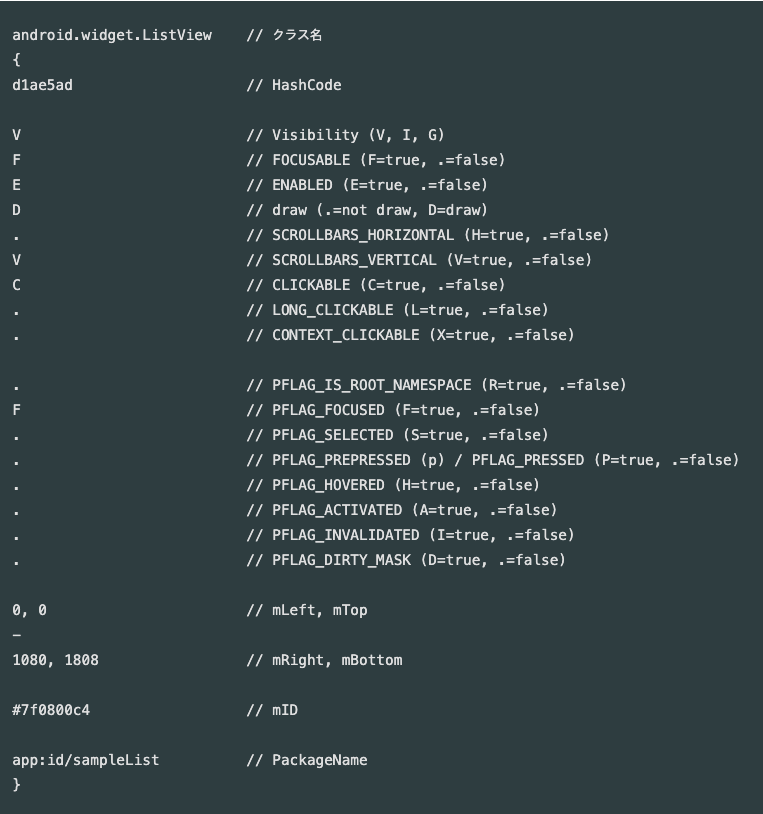

# Dumpsys

안드로이드를 개발하다보면 현재 시스템 상태에 대해서 궁금할 때가 있다. View Hierarchy라던지, 현재 Focus는 누가 가져갔는지 audio는 현재 누구한테 할당되어 있는지 등 이런 시스템 정보를 볼 수 있는 시스템 명령어가 **dumpsys** 이다. dumpsys를 통해 각 서비스들의 상태를 확인할 수 있다.

## 1. Adb Shell 접근하기

터미널에서 아래와 같이 명령어를 입력하면 usb에 연결되어 있는 디바이스 쉘로 들어갈 수 있다.

```
adb shell
```

 단 여러 디바이스가 연결된 경우 다음과 같은 명령어를 사용하여 디바이스들을 확인하고

```
adb devices
```

```
List of devices attached
1c7aafe73b037bce        device
973c6678        device
...
```

그중에 원하는 디바이스 ID로 아래와 같이 접근 가능

```
adb -s 973c6678 shell
```


## 2. 원하는 시스템 상태 확인하기

### Activity 시스템 상태 확인하기

예를 들어 Activity의 시스템 상태를 확인하기 activity Service에서 해당 dump를 제공해주며 아래와 같이 사용할 수 있다.

```
//명령어 
adb shell dumpsys activity ${packageName}
```

아래와 같이 현재 떠있는 activity나 fragment를 확인할 수 있고 View Hierarchy도 함께 확인 할 수 있다.

```
TASK com.kakao.talk id=595 userId=0
  ACTIVITY com.kakao.talk/.activity.main.MainTabFragmentActivity 451df53 pid=23007
    Local Activity b5337ad State:
      mResumed=false mStopped=true mFinished=false
      mChangingConfigurations=false
      mCurrentConfig={0 1.1 themeSeq = 0 showBtnBg = 0 450mcc6mnc [ko_KR] ldltr sw411dp w411dp h773dp 420dpi nrml long hdr port finger -keyb/v/h -nav/h appBounds=Rect(0, 0 - 1080, 2094) s.45 mkbd/h desktop/d ?dc}
      threadConfig={0 1.1 themeSeq = 0 showBtnBg = 0 450mcc6mnc [ko_KR] ldltr sw411dp w411dp h773dp 420dpi nrml long hdr port finger -keyb/v/h -nav/h appBounds=Rect(0, 0 - 1080, 2094) s.45 mkbd/h desktop/d ?dc}  isDexCompatMode=false
      mLoadersStarted=true
      Active Fragments in 2fd1a78:
      ...  
      
      View Hierarchy:
      DecorView@e88d633[MainTabFragmentActivity]
        android.widget.LinearLayout{e3a58d V.E...... ......ID 0,0-1080,2094}
          android.view.ViewStub{56ca342 G.E...... ......I. 0,0-0,0 #10201c4 android:id/action_mode_bar_stub}
          android.widget.FrameLayout{bcf53 V.E...... ......ID 0,63-1080,2094}
            androidx.appcompat.widget.FitWindowsLinearLayout{b64c090 V.E...... ......ID 0,0-1080,2031 #7f09001f app:id/action_bar_root}
              androidx.appcompat.widget.ViewStubCompat{bf20d89 G.E...... ......I. 0,0-0,0 #7f09003b app:id/action_mode_bar_stub}
              androidx.appcompat.widget.ContentFrameLayout{725b18e V.E...... ......ID 0,0-1080,2031 #1020002 android:id/content}
                android.widget.RelativeLayout{8fa0daf V.E...... ......ID 0,0-1080,2031}
                  androidx.coordinatorlayout.widget.CoordinatorLayout{6fd55bc V.E...... ......ID 0,0-1080,2031}
                    com.kakao.talk.activity.main.MainTabAppBarLayout{bbf4fb4 V.E...... ......ID 0,0-1080,0}
                      com.kakao.talk.widget.theme.ThemeToolBar{564f945 G.E...... ......ID 0,0-0,0 #7f091401 app:id/toolbar}
                        com.kakao.talk.widget.theme.ThemeRelativeLayout{4f589a V.E...... ......I. 0,0-0,0 #7f09140d app:id/toolbar_main_container}
                        ... 
```


### 그외 시스템 상태 확인하기

```
dumpsys ${service}
```

위와 같이 dumpsys를 사용해서 서비스를 얻는 방법을 알아보았는데, 해당 서비스는 activity외에 어떤 것들이 있는지? 이런 것들은 어떻게 확인할 수 있는지 알아보자

해당 서비스에 들어갈 수 있는 이름들은 모두 **context.java**에 나열되어 있다.

context.java에서 스트럭쳐를 보면 아래와 같이 서비스 이름들이 상수로 들어간 것을 확인할 수 있는데

```
    public static final String POWER_SERVICE = "power";

    public static final String RECOVERY_SERVICE = "recovery";

    public static final String SYSTEM_UPDATE_SERVICE = "system_update";

    public static final String WINDOW_SERVICE = "window";

    public static final String LAYOUT_INFLATER_SERVICE = "layout_inflater";

    public static final String ACCOUNT_SERVICE = "account";

    public static final String ACTIVITY_SERVICE = "activity";
    
    ...
```

외에도 많은 서비스 이름들이 있다. ACTIVITY_SERVICE의 이름인 'activity'를 활용하여 해당 ACTIVITY_SERVICE 상태를 알 수 있었다.


### 나오는 결과를 모르겠어..

 하지만 이렇게 보더라도 딱 보기에 알아볼 수 있는 메시지와 알아보기 어려운 메시지들이 있는데, 대체 이 메시지는 어떤걸 출력한거야? 라고 생각을 할 수 있다. 그럴 땐 해당 서비스의 dump라는 메서드를 확인해보면 된다. 
 예를 들어 audio Service에 dumpsys를 보면
 
 ```
 
MediaFocusControl dump time: 오후 3:49:21

Audio Focus stack entries (last is top of stack):

MultiFocusStack:
size:2
device:2
------------------------------
device = 0
...
 ```
 
으로 시작하는데, 이 내용은 AudioService.java에 dump 메서드에 있다.

```
//AudioService


    @Override
    protected void dump(FileDescriptor fd, PrintWriter pw, String[] args) {
        if (!DumpUtils.checkDumpPermission(mContext, TAG, pw)) return;

        mMediaFocusControl.dump(pw);
        dumpStreamStates(pw);
        dumpRingerMode(pw);
        ...

```

코드에서 'mMediaFocusControl'의 dump를 실행하는데 해당 메서드에서 audioService dumpsys의 맨 윗줄인 'MediaFocusControl dump time: 오후 3:49:21'를 출력하는걸 볼 수 있다.

```
    protected void dump(PrintWriter pw) {
        pw.println("\nMediaFocusControl dump time: "
                + DateFormat.getTimeInstance().format(new Date()));
        dumpFocusStack(pw);
        pw.println("\n");
        // log
        mEventLogger.dump(pw);
    }

```
    
   
   
이렇게 모르는 메시지는 현재 어떤걸 출력하고 있는지 까지 확인할 수 있다.

### View Hierarchy Descrption




### 유용한 한줄

* adb shell dumpsys activity top | grep -E 'Fragment|Activity'  > test.txt : 간단하게 Fragment와 Activity의 하이라키만 보고싶을 때 사용하기;.

## 결론..?

dumpsys는 주로 View Hierarchy를 확인하기 위해서 자주썼었는데, 최근엔 Tools에 LayoutInspector를 활용하면 볼 수 있기 때문에 (가끔 안되지만) 자주 사용할 일이 없지만, 대체 무슨 일인지 모르겠을 때 도움이 된다.