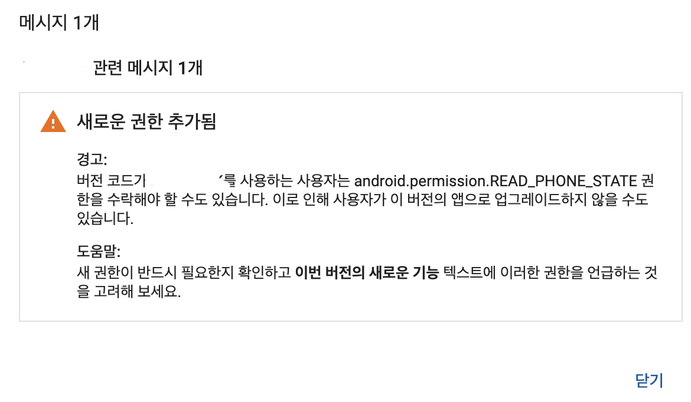
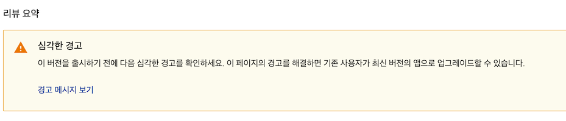

## permissions in apk

apk에 추가된 퍼미션들은 비단 내가 AndroidManifast에 추가한 권한들만 들어가는 것은 아니다. 사용하고 있는 라이브러리에서 기능을 온전히 제공하기 위해서 권한을 임의로 추가할 수 있으며 그로인해 내가 원하는 권한이 아닌 권한이 추가될 수 있다.

요렇게 권한이 추가되면 play store에서 권한이 추가되었으며 자동업데이트가 될 수 없을 수 있다는 경고 메시지가 뜨게 되는데 아래와 같은 메시지가 나타난다.
(아마도 6.0이상은 자동업데이트될 것같고 그 이하는 안될 것같은데 확인이 필요하다)





이럴 때 어떤 라이브러리에서 권한을 추가했는지 확인하는게 여러 가지 방법이 있다.

### check gradle

간단한 방법으론 먼저 내가 수정한 그래이들에 가서 추가한 라이브러리나 버전코드가 바뀐 라이브러리를 확인해보는 방법이다. 가장 간단하게 떠오르기도하지만 만약 앱서비스가 큰 경우라면 이렇게 찾기 어려울 수 있다.


### check outputs

```app -> build -> outputs -> apk -> AndroidManifast``` 를 확인해본다면 최종적으로 빌드에 추가된 권한을 확인 해볼 수 있고, 정확히 어디서 추가했는지 알려면 ```app -> build -> outputs -> log -> manifast-report.txt``` 를확인한다면

```
uses-permission#android.permission.RECORD_AUDIO
ADDED from /home/jack/AndroidProject/ApiDemos/app/src/main/AndroidManifest.xml:45:5-71
    android:name
            ADDED from /home/jack/AndroidProject/ApiDemos/app/src/main/AndroidManifest.xml:45:22-68
uses-permission#android.permission.CAMERA
ADDED from /home/jack/AndroidProject/ApiDemos/app/src/main/AndroidManifest.xml:49:5-65
    android:name
            ADDED from /home/jack/AndroidProject/ApiDemos/app/src/main/AndroidManifest.xml:49:22-62
```

요런식으로 어디서 추가했는지 파일 이름과 lib이름도 확인해볼 수 있다.

